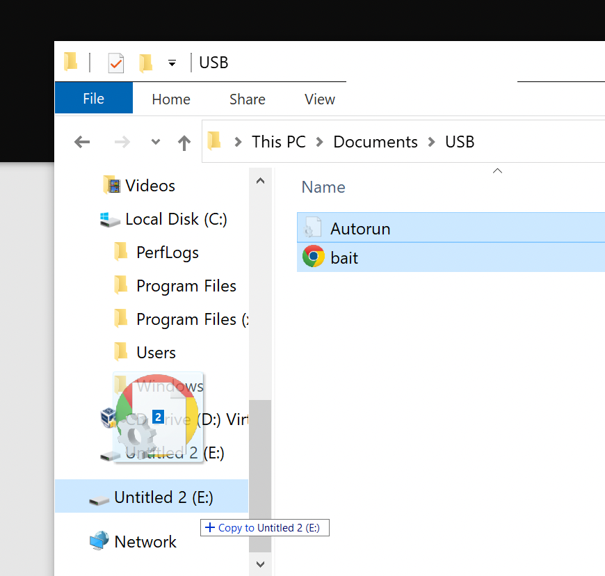

# Odysseus-USB

### Background
USBs are a unique attack vector since they can negate almost all network security controls. Since a USB drive is a piece of hardware, people might not think twice before inserting one into their computer. 

Much like the story of the trojan horse, a simple USB is able to breach the perimeter of an organization without much alarm, only to unleash its true capabilities once plugged into a system.

With this knowledge, some organizations have disconnected USB ports from their systems. Additionally, Microsoft has turned off the autorun feature by default on Windows 10, however some legacy systems may still have this enabled, meaning no interaction is required - once the USB has been inserted into a machine - in order for a payload to be delivered. 

### Demonstration
With the power of Python tools, a criminal is able to wrap malicious python code into an inconspicuous looking executable file. Just in case, there is also a hidden file that will autorun the malicious code, assuming autorun is turned off or is plugged into a legacy system. If not, the executable file should be enticing enough to bait a victim into clicking on it and running the code. 

Python encapsulator: 
This code essentially wraps the malicious file called 'dontrust.py' into a bait executable file. In this case, we have given the executable the Google Chrome icon photo to make it more enticing. 

This code also cleans up certain files, folders, and verbosity, and generates the autorun file. 

[CreateUSB.py](resources/CreateUSB.py)

In this case, the malicious file simply opens a webpage to `https://haveibeenpwned.com/`. however using imagination, the possibilities are endless. 

[dontrust.py](resources/dontrust.py)

In order to seem more enticing, we also add an icon to the executable. In this case we use Google Chrome, however any icon can be used by leveraging the following webb application: `https://icoconvert.com/`

[Chrome.ico](resources/Chrome.ico)

## Video Demo of `dontrust.py`

https://user-images.githubusercontent.com/93690728/167065642-ae45de9c-4415-4cc2-88ea-c37d706427e4.mov

## Video Demo of `CreateUSB.py`

https://user-images.githubusercontent.com/93690728/167065601-3cf1946a-3975-4d1c-a3c1-a24515ca841c.mov

## Copy executable and autorun file into USB drive

## Video Demo of USB action

https://user-images.githubusercontent.com/93690728/167066591-20123a07-8fb5-48e5-b2ea-458fc4b73ba6.mov

## Summary
It quickly becomes clear how this functionality could be leveraged by a criminal with a little imagination. Next time you go to plug in a USB, think twice about where it may have come from. 

### Note
This is a proof of concept only and should not be used to exploit any non-sandbox environments. Source code was modified from the 'Python for Cybersecurity' Coursera modules by Howard Poston.

